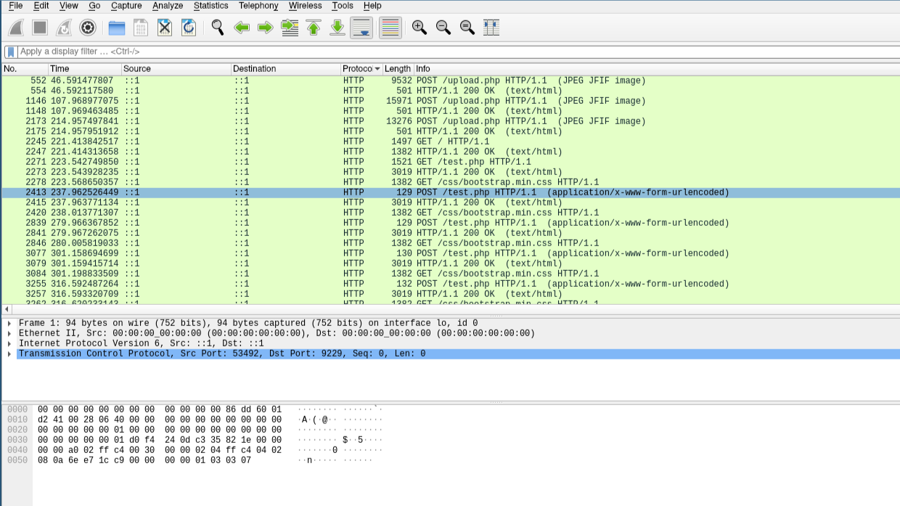
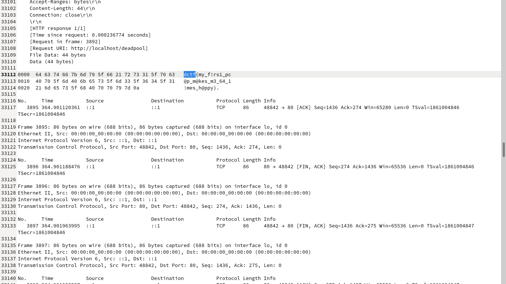

# Delta CTF 2020: Trafficking capture.

> Find and submit the {flag}
>
> (./File/secret.pcapng)

## Write-up

1. You are given a pcapng file named secret.pcapng, we will open this file using wireshark.

We can see a large number of packets with some different protocols used.

2. Just sort the protocols alphabetically, starting from http packets first. We can see multiple php files used here that are test.php, upload.php etc. 

Also we can see some images being uploaded. But there is no need to go into that as the images are just a distraction.

3. Just export all packets dissection as a plain text file. We get all the traffic inside a plain txt file now.

As we know that the flag is in the format dctf{something_something}, just search for dctf inside this text file.

You can see the flag here broken into pieces
dctf{my_f!rs1_pc@p_m@kes_m3_64_1!mes_h@ppy}

