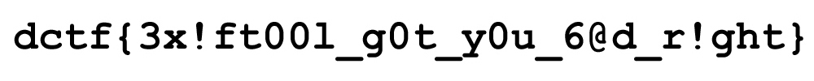

# Delta CTF 2020: As if you know your Ex'if.


> Find and submit the {flag}
>
> (./Challenge/The_Broken_pieces.zip)

## Write-up

1. You are given a normal zip file "The_Broken_pieces.zip" which has a folder named "pieces". This folder has 100 random images inside it.

```bash
$ ls pieces/
00ad6b.jpg  32a52b.jpg  5b58e0.jpg  990eb2.jpg  d77214.jpg
041991.jpg  337452.jpg  5d2228.jpg  9baa57.jpg  d785c5.jpg
0501fd.jpg  33ffea.jpg  5d3ee7.jpg  a3a8c7.jpg  d9e1ee.jpg
051f14.jpg  34d896.jpg  5fb8d4.jpg  a3eaf4.jpg  dd0eaa.jpg
05375b.jpg  356c5c.jpg  6479c9.jpg  a405e0.jpg  df8f8a.jpg
097b5e.jpg  3d1c4d.jpg  6976e0.jpg  a93144.jpg  e1e9f7.jpg
0a7d4e.jpg  3d534a.jpg  6be7c9.jpg  addf3b.jpg  e306a9.jpg
0cb4c6.jpg  3d8adb.jpg  6f1400.jpg  af0a95.jpg  e41fd2.jpg
0d9ab3.jpg  3f5776.jpg  729de2.jpg  b2a4f2.jpg  ea7bbb.jpg
0dcf84.jpg  41894a.jpg  742aaa.jpg  b2da9e.jpg  eb5e40.jpg
0e6dd1.jpg  42aa8d.jpg  768da6.jpg  b47f39.jpg  eed625.jpg
1037c6.jpg  42fbb8.jpg  7b7fd6.jpg  b4d662.jpg  efc476.jpg
1142b7.jpg  44b338.jpg  7d6183.jpg  b64f21.jpg  f07a2a.jpg
153bcd.jpg  4550c0.jpg  7dbff5.jpg  badbbd.jpg  f485ef.jpg
175d1f.jpg  456625.jpg  887617.jpg  bb6cd4.jpg  f7a8e9.jpg
194fc8.jpg  493537.jpg  8ded79.jpg  c435a3.jpg  f85baa.jpg
19f832.jpg  4cea09.jpg  8ec994.jpg  c571ce.jpg  f8e4d8.jpg
21c8ec.jpg  51cb75.jpg  929e93.jpg  ca4e28.jpg  faa72e.jpg
25d5a9.jpg  52868f.jpg  97c9fe.jpg  d05690.jpg  fbcd4c.jpg
2d6986.jpg  5954e3.jpg  988d91.jpg  d3c8bb.jpg  fffdcf.jpg
```

Each image has some unclear picture in it. This time even the names are not helping us to find anything.
Clearly as the name of the folder suggests, these images combine to form up a bigger image but there has to be a fixed manner we should combine these images to find the bigger image.

2. As the name of the challenge says, "Ex'if" , we can try exiftool to extract the metadata inside the images. Let's see what's hidden inside these random images.

```bash
$ exiftool 0e6dd1.jpg 
ExifTool Version Number         : 11.85
File Name                       : 0e6dd1.jpg
Directory                       : .
File Size                       : 609 bytes
File Modification Date/Time     : 2020:06:08 12:45:18+05:30
File Access Date/Time           : 2020:06:08 12:46:04+05:30
File Inode Change Date/Time     : 2020:06:08 12:53:30+05:30
File Permissions                : rw-r--r--
File Type                       : JPEG
File Type Extension             : jpg
MIME Type                       : image/jpeg
JFIF Version                    : 1.01
Exif Byte Order                 : Big-endian (Motorola, MM)
X Resolution                    : 1
Y Resolution                    : 1
X Position                      : 3
Y Position                      : 6
Resolution Unit                 : None
Y Cb Cr Positioning             : Centered
Image Width                     : 100
Image Height                    : 10
Encoding Process                : Baseline DCT, Huffman coding
Bits Per Sample                 : 8
Color Components                : 1
Image Size                      : 100x10
Megapixels                      : 0.001

$ exiftool 97c9fe.jpg 
ExifTool Version Number         : 11.85
File Name                       : 97c9fe.jpg
Directory                       : .
File Size                       : 656 bytes
File Modification Date/Time     : 2020:06:08 12:45:18+05:30
File Access Date/Time           : 2020:06:08 12:46:10+05:30
File Inode Change Date/Time     : 2020:06:08 12:53:30+05:30
File Permissions                : rw-r--r--
File Type                       : JPEG
File Type Extension             : jpg
MIME Type                       : image/jpeg
JFIF Version                    : 1.01
Exif Byte Order                 : Big-endian (Motorola, MM)
X Resolution                    : 1
Y Resolution                    : 1
X Position                      : 1
Y Position                      : 6
Resolution Unit                 : None
Y Cb Cr Positioning             : Centered
Image Width                     : 100
Image Height                    : 10
Encoding Process                : Baseline DCT, Huffman coding
Bits Per Sample                 : 8
Color Components                : 1
Image Size                      : 100x10
Megapixels                      : 0.001

$ exiftool b47f39.jpg 
ExifTool Version Number         : 11.85
File Name                       : b47f39.jpg
Directory                       : .
File Size                       : 295 bytes
File Modification Date/Time     : 2020:06:08 12:45:08+05:30
File Access Date/Time           : 2020:06:08 12:46:20+05:30
File Inode Change Date/Time     : 2020:06:08 12:53:30+05:30
File Permissions                : rw-r--r--
File Type                       : JPEG
File Type Extension             : jpg
MIME Type                       : image/jpeg
JFIF Version                    : 1.01
Exif Byte Order                 : Big-endian (Motorola, MM)
X Resolution                    : 1
Y Resolution                    : 1
X Position                      : 3
Y Position                      : 1
Resolution Unit                 : None
Y Cb Cr Positioning             : Centered
Image Width                     : 100
Image Height                    : 10
Encoding Process                : Baseline DCT, Huffman coding
Bits Per Sample                 : 8
Color Components                : 1
Image Size                      : 100x10
Megapixels                      : 0.001
```

Notice that there are two tags named "X Position" and "Y Position". Yes, these are the positions of each piece inside the bigger picture. There are 100 pieces with x and y positions varying from 0-9 each. Now we need a method to combine these images based on the positons mentioned inside their exifdata.
But picking up each image according to the required position everytime starting from (0,0) upto (9,9) will take a lot of time. Instead we can try changing the names of each image based on their positions since their current names are of no use. Then we can use the same script we used for the last task to combine the images based on their names. The scripts 'exif.py' and 'merge.sh' are uploaded in the same folder along with the writeup. Just run the python script 'exif.py' inside the "The_Broken_pieces" folder outside pieces and it will give you the final image.

```bash
The_Broken_pieces $ ls
exif.py  merge.sh  pieces/
The_Broken_pieces $ python exif.py
```
 
3. You will find an image named final.jpg inside the pieces folder 


Congrats you found your flag- "dctf{3x!ft00l_g0t_y0u_6@d_r!ght}"
