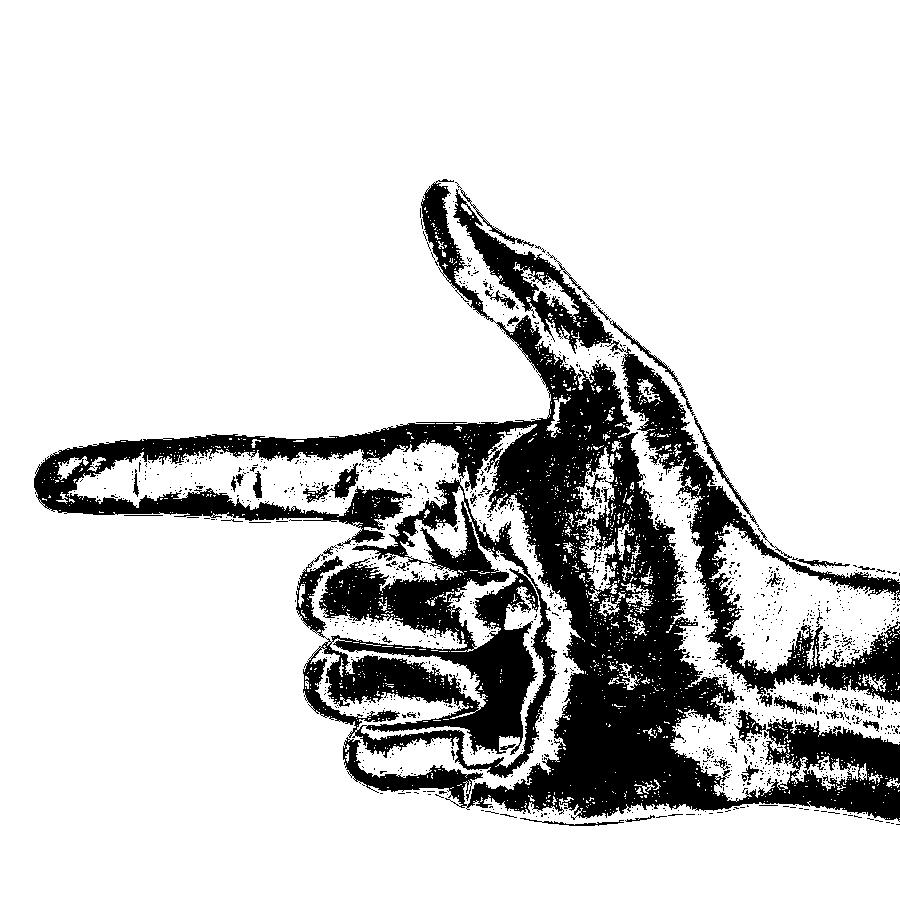
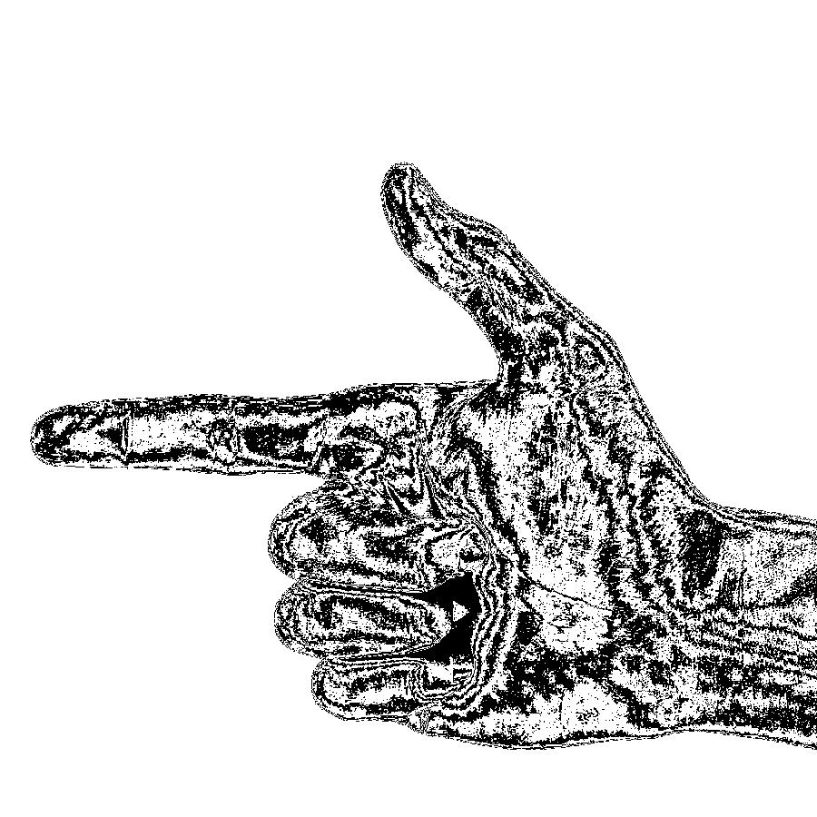
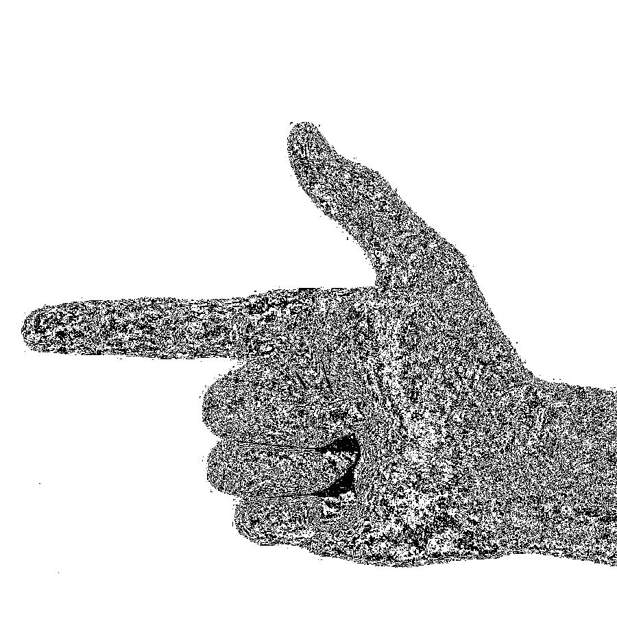
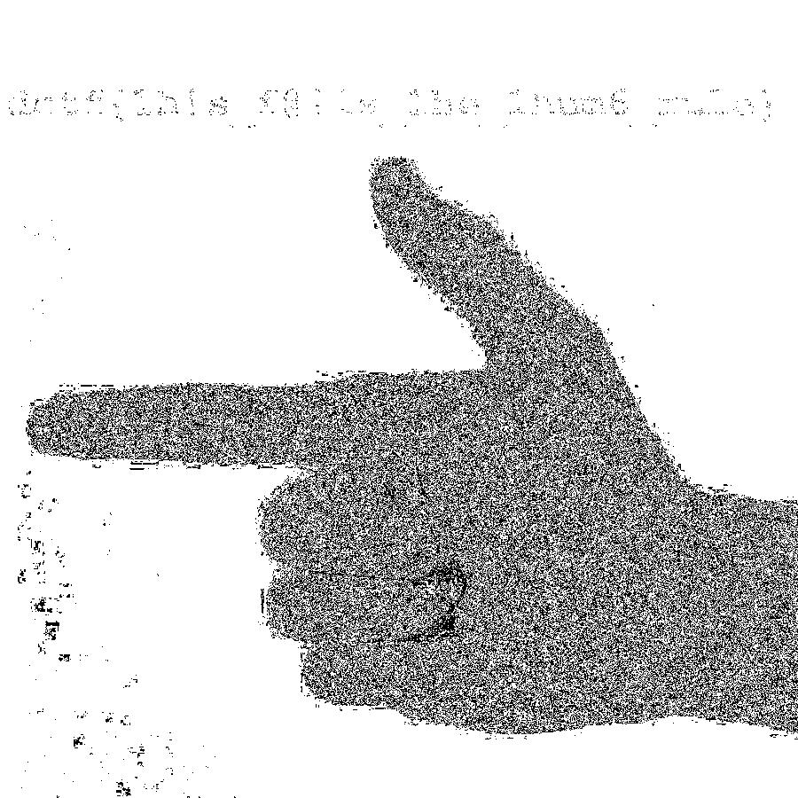
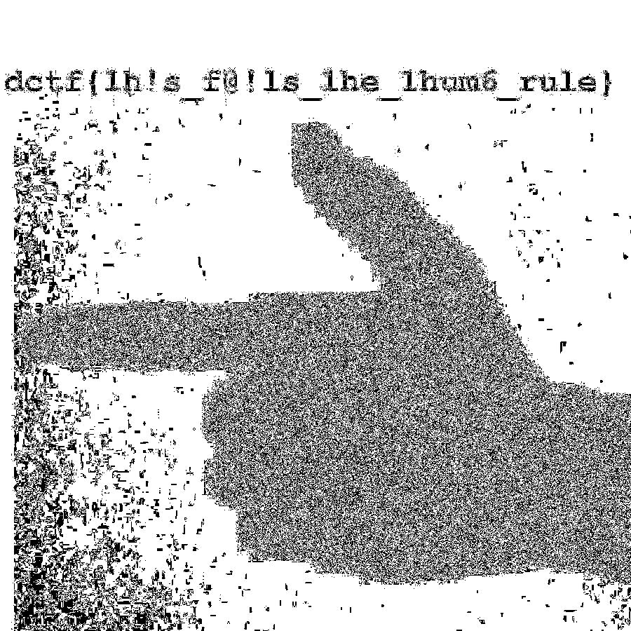
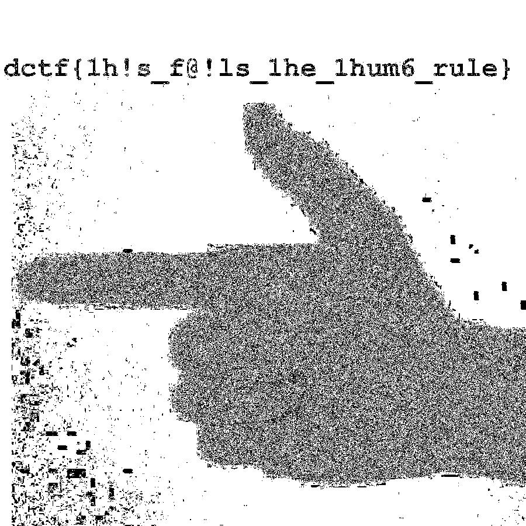

# Delta CTF 2020: Right Hand Thumb Rules.


> Find and submit the {flag}
>
> (./File/thumbnails.zip)

## Write-up

1. You are given a password protected zip file "thumbnails.zip". It has an unknown password, which has been given in the question itself "Fleming",
unzip the file using the password.

```bash
$ unzip -e thumbnails.zip 
Archive:  thumbnails.zip
   creating: rules/
[thumbnails.zip] rules/f2afaf.jpg password: 
  inflating: rules/f2afaf.jpg        
  inflating: rules/223fcd.jpg        
  inflating: rules/174244.jpg        
  inflating: rules/e51996.jpg        
  inflating: rules/bf0752.jpg        
  inflating: rules/b8618a.jpg        
  inflating: rules/90278d.jpg        
  inflating: rules/82cbb2.jpg        
  inflating: rules/f1aa6e.jpg        
  inflating: rules/45eb30.jpg        
  inflating: rules/ff2f2d.jpg        
  inflating: rules/c43df0.jpg        
  inflating: rules/88c4ea.jpg        
  inflating: rules/948ef1.jpg        
  inflating: rules/ab6a35.jpg        
  inflating: rules/96eb0b.jpg        
  inflating: rules/040202.jpg        
  inflating: rules/ced656.jpg        
  inflating: rules/f6c2a6.jpg        
  inflating: rules/d14017.jpg        
  inflating: rules/6f194b.jpg        
  inflating: rules/b2ab42.jpg        
  inflating: rules/7e2636.jpg        
  inflating: rules/8c6eeb.jpg        
  inflating: rules/0f9f4f.jpg        
  inflating: rules/c6b18e.jpg        
  inflating: rules/95ca9a.jpg        
  inflating: rules/dabfda.jpg        
  inflating: rules/b670fb.jpg        
  inflating: rules/b43445.jpg        
  inflating: rules/d8b6b7.jpg        
  inflating: rules/bbd8b2.jpg        
  inflating: rules/f8867a.jpg        
  inflating: rules/10b3e1.jpg        
  inflating: rules/2fd0e5.jpg        
  inflating: rules/d824cb.jpg        
  inflating: rules/403a86.jpg        
  inflating: rules/24d147.jpg        
  inflating: rules/d2aab2.jpg        
  inflating: rules/38264c.jpg        
  inflating: rules/edfaf9.jpg        
  inflating: rules/a83af2.jpg        
  inflating: rules/dce23f.jpg        
  inflating: rules/7d987a.jpg        
  inflating: rules/dba930.jpg        
  inflating: rules/f4730b.jpg        
  inflating: rules/d3d84f.jpg        
  inflating: rules/05e1a9.jpg        
  inflating: rules/c51c8b.jpg        
  inflating: rules/d0ae94.jpg        
  inflating: rules/266520.jpg        
  inflating: rules/561073.jpg        
  inflating: rules/82fad5.jpg        
  inflating: rules/59d141.jpg        
  inflating: rules/b687d7.jpg        
  inflating: rules/08a16a.jpg        
  inflating: rules/adedfd.jpg        
  inflating: rules/d5724d.jpg        
  inflating: rules/7c93e9.jpg        
  inflating: rules/8f3852.jpg        
  inflating: rules/e650fd.jpg        
  inflating: rules/0f3b77.jpg        
  inflating: rules/377105.jpg        
  inflating: rules/c3b323.jpg        
  inflating: rules/b1ebd2.jpg        
  inflating: rules/152645.jpg        
  inflating: rules/c63f9d.jpg        
  inflating: rules/e4dc71.jpg        
  inflating: rules/ba43f0.jpg        
  inflating: rules/19f5cb.jpg        
  inflating: rules/86207c.jpg        
  inflating: rules/e1c023.jpg        
  inflating: rules/d51256.jpg        
  inflating: rules/c11b87.jpg        
  inflating: rules/4cb152.jpg        
  inflating: rules/ee294c.jpg        
  inflating: rules/7fe5a5.jpg        
  inflating: rules/8afa21.jpg        
  inflating: rules/781bfd.jpg        
  inflating: rules/fc749b.jpg        
  inflating: rules/997f00.jpg        
  inflating: rules/1a517b.jpg        
  inflating: rules/4b6b3f.jpg        
  inflating: rules/cba8fb.jpg        
  inflating: rules/282930.jpg        
  inflating: rules/9cb852.jpg        
  inflating: rules/59d050.jpg        
  inflating: rules/babcef.jpg        
  inflating: rules/a4a97b.jpg        
  inflating: rules/81958b.jpg        
  inflating: rules/df2a05.jpg        
  inflating: rules/6d2389.jpg        
  inflating: rules/4be1b2.jpg        
  inflating: rules/9b38aa.jpg        
  inflating: rules/b3388b.jpg        
  inflating: rules/8656c6.jpg        
  inflating: rules/d526c5.jpg        
  inflating: rules/e05ff5.jpg        
  inflating: rules/15ad28.jpg        
  inflating: rules/82c58b.jpg

```

You got a folder named "rules" with 100 random  files. These files are clearly a part of a bigger image just like the last question. They all have abrupt names, while there positions are hidden inside the exifdata of each file.

2. Try exiftool to extract the metadata inside the images. Let's see what's hidden inside these random images.

```bash
$ exiftool 040202.jpg 
ExifTool Version Number         : 11.85
File Name                       : 040202.jpg
Directory                       : .
File Size                       : 4.2 kB
File Modification Date/Time     : 2020:06:08 13:27:38+05:30
File Access Date/Time           : 2020:06:08 13:28:14+05:30
File Inode Change Date/Time     : 2020:06:08 17:28:46+05:30
File Permissions                : rw-r--r--
File Type                       : JPEG
File Type Extension             : jpg
MIME Type                       : image/jpeg
JFIF Version                    : 1.01
Exif Byte Order                 : Big-endian (Motorola, MM)
X Resolution                    : 72
Y Resolution                    : 72
X Position                      : 6
Y Position                      : 0
Resolution Unit                 : inches
Y Cb Cr Positioning             : Centered
IPTC Digest                     : 00000000000000000000000000000000
Displayed Units X               : inches
Displayed Units Y               : inches
Print Style                     : Centered
Print Position                  : 0 0
Print Scale                     : 1
Global Angle                    : 120
Global Altitude                 : 30
Copyright Flag                  : False
URL List                        : 
Slices Group Name               : delta_ctf2
Num Slices                      : 1
Photoshop Thumbnail             : (Binary data 2483 bytes, use -b option to extract)
Has Real Merged Data            : Yes
Writer Name                     : Adobe Photoshop
Reader Name                     : Adobe Photoshop 7.0
Photoshop Quality               : 12
Photoshop Format                : Standard
Progressive Scans               : 3 Scans
Image Width                     : 90
Image Height                    : 90
Encoding Process                : Baseline DCT, Huffman coding
Bits Per Sample                 : 8
Color Components                : 1
Image Size                      : 90x90
Megapixels                      : 0.008

$ exiftool b687d7.jpg 
ExifTool Version Number         : 11.85
File Name                       : b687d7.jpg
Directory                       : .
File Size                       : 11 kB
File Modification Date/Time     : 2020:06:08 13:27:52+05:30
File Access Date/Time           : 2020:06:08 13:28:04+05:30
File Inode Change Date/Time     : 2020:06:08 17:28:46+05:30
File Permissions                : rw-r--r--
File Type                       : JPEG
File Type Extension             : jpg
MIME Type                       : image/jpeg
JFIF Version                    : 1.01
Exif Byte Order                 : Big-endian (Motorola, MM)
X Resolution                    : 72
Y Resolution                    : 72
X Position                      : 3
Y Position                      : 6
Resolution Unit                 : inches
Y Cb Cr Positioning             : Centered
IPTC Digest                     : 00000000000000000000000000000000
Displayed Units X               : inches
Displayed Units Y               : inches
Print Style                     : Centered
Print Position                  : 0 0
Print Scale                     : 1
Global Angle                    : 120
Global Altitude                 : 30
Copyright Flag                  : False
URL List                        : 
Slices Group Name               : delta_ctf2
Num Slices                      : 1
Photoshop Thumbnail             : (Binary data 2483 bytes, use -b option to extract)
Has Real Merged Data            : Yes
Writer Name                     : Adobe Photoshop
Reader Name                     : Adobe Photoshop 7.0
Photoshop Quality               : 12
Photoshop Format                : Standard
Progressive Scans               : 3 Scans
Image Width                     : 90
Image Height                    : 90
Encoding Process                : Baseline DCT, Huffman coding
Bits Per Sample                 : 8
Color Components                : 3
Y Cb Cr Sub Sampling            : YCbCr4:4:4 (1 1)
Image Size                      : 90x90
Megapixels                      : 0.008

```

Notice that here also there are two tags named "X Position" and "Y Position". These are the positions of each piece inside the bigger picture. There are 100 pieces with x and y positions varying from 0-9 each. Now we need a method to combine these images based on the positons mentioned inside their exifdata.
We can use the same script we used for the last task to combine the images based on their names. The scripts 'exif.py' and 'merge.sh' are uploaded in the same folder along with the writeup. Just run the python script 'exif.py' outside the "rules" folder and it will give you the final image.

```bash
$ python exif.py
$
```
 
3. You will find an image named final.jpg inside the rules folder 


But this ain't this simple, is it?
The image just has an image of a thumb which is clearly not the flag. Running exiftool won't help too

```bash
$ exiftool final.jpg 
ExifTool Version Number         : 11.85
File Name                       : final.jpg
Directory                       : .
File Size                       : 272 kB
File Modification Date/Time     : 2020:06:08 17:38:23+05:30
File Access Date/Time           : 2020:06:08 17:38:23+05:30
File Inode Change Date/Time     : 2020:06:08 17:38:29+05:30
File Permissions                : rw-r--r--
File Type                       : JPEG
File Type Extension             : jpg
MIME Type                       : image/jpeg
JFIF Version                    : 1.01
IPTC Digest                     : 00000000000000000000000000000000
X Resolution                    : 72
Displayed Units X               : inches
Y Resolution                    : 72
Displayed Units Y               : inches
Print Style                     : Centered
Print Position                  : 0 0
Print Scale                     : 1
Global Angle                    : 120
Global Altitude                 : 30
Copyright Flag                  : False
URL List                        : 
Slices Group Name               : delta_ctf2
Num Slices                      : 1
Photoshop Thumbnail             : (Binary data 2483 bytes, use -b option to extract)
Has Real Merged Data            : Yes
Writer Name                     : Adobe Photoshop
Reader Name                     : Adobe Photoshop 7.0
Photoshop Quality               : 12
Photoshop Format                : Standard
Progressive Scans               : 3 Scans
Exif Byte Order                 : Big-endian (Motorola, MM)
X Position                      : 0
Y Position                      : 0
Resolution Unit                 : inches
Y Cb Cr Positioning             : Centered
Image Width                     : 900
Image Height                    : 900
Encoding Process                : Baseline DCT, Huffman coding
Bits Per Sample                 : 8
Color Components                : 3
Y Cb Cr Sub Sampling            : YCbCr4:4:4 (1 1)
Image Size                      : 900x900
Megapixels                      : 0.810
```

4. Let's see if this image is hiding something inside it by changing it's properties. You can use photoshop, while i used stegsolve as it's easy to use.
Try multiple frames and see what you get.







Congrats you got the flag - "dctf{1h!s_f@!ls_1he_1hum6_rule}"
